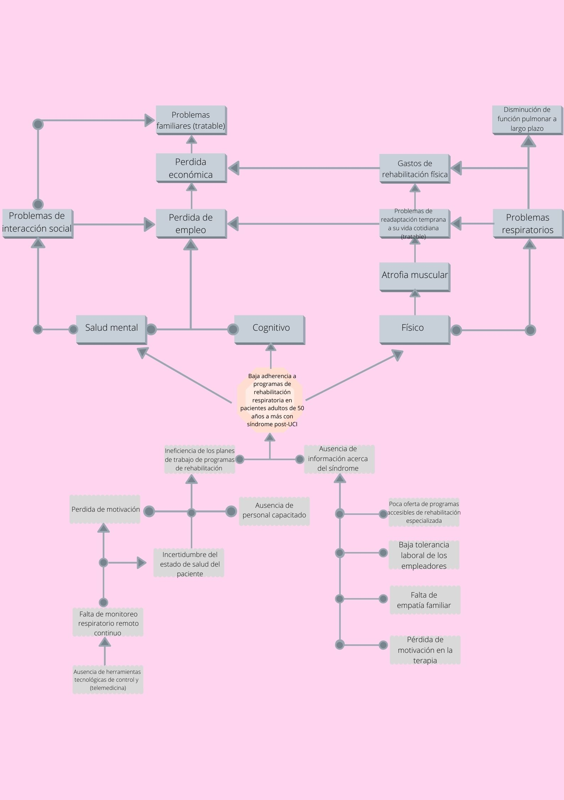

# Entregable-1

El síndrome post-UCI es aquella situación que afecta a pacientes 30- 50% que sobreviven a su estancia en la unidad de cuidados intensivos y que al recibir el alta de la uci presentan secuelas físicas, cognitivas y psíquicas que impactan de forma negativa en su calidad de vida, así como en la de sus familiares y cuidadores (1). Dejando secuelas físicas y emocionales por ello la importancia de intervención del fisioterapeuta en el seguimiento del paciente con Síndrome Post-Uci de coronavirus, junto al equipo multidisciplinario para garantizar la recuperación de la funcionalidad después de haber abandonado la unidad de cuidados intensivos.

  

<h1>PROBLEMA: BAJA ADHERENCIA A PROGRAMAS DE REHABILITACIÓN PARA PACIENTES MAYORES DE 50 AÑOS CON SINDROME POST-UCI</h1>
<h1>CAUSAS:</h1>
<h2>Desinterés de parte de las autoridades de salud pública por programas de rehabilitación</h2>
<h3>- SEGUIMIENTO DEL CENTRO DE SALUD:</h3>

No hay monitoreo continuo al tratamiento de rehabilitación post-uci. Estas medidas son recomendadas para el seguimiento de pacientes que permiten establecer los lineamientos básicos para la identificación y tratamiento precoz de las complicaciones asociadas al síndrome (2). Asimismo, esto principalmente es causa del desinterés por parte de los centros de salud. 

<h3>- AUSENCIA DE DISPOSITIVOS DE ASISTENCIA MEDICA:</h3>

Los procesos de monitoreo, evaluación y control comparan continuamente el desempeño real con el plan de implementación del proyecto (3). Y a causa de que no hay un seguimiento por parte de las identidades sanitarias un hay un margen o una propuesta para poder implementar este tipo de herramientas en los pacientes post-uci.	

<h2>Adherencia al Tratamiento</h2>

Según la OMS, tan solo el 50% de pacientes, en países desarrollados, que sufren enfermedades crónicas continúan con el tratamiento. De esto se puede deducir que ante enfermedades agudas y en países de calidad de vida media-baja, la adherencia será menor. Asimismo, Una buena adherencia implica una reducción en el uso de recursos sanitarios, es decir, menor gasto para el estado.
 
<h3>- FALTA DE APOYO FAMILIAR:</h3>

Los pacientes cambian notoriamente su estilo de vida en una terapia de rehabilitación post-uci para continuar viviendo, ofreciéndole una mejor calidad de, pero no asegurando su recuperación al 100%. La adherencia a la rehabilitación si es muy importante y estaría relacionada con el apoyo familiar, sobre todo por estar cerca al paciente y afrontar conjuntamente los múltiples cambios que conlleva esta compleja situación (4) luego de dejar uci y su tratamiento.

<h3>- POCA OFERTA DE PROGRAMAS ACCESIBLES DE REHABILITACION ESPECIALIZADA:</h3>

Muchas veces los centros de salud se localizan en lugares lejanos tanto como en lima como en las zonas rurales. Esto implica mucho en la adherencia en los pacientes ya que no concluyen su terapia al poder asistir a ellas. Esto está muy relacionado con el apoyo familiar, puesto que en un estado post-uci dependes de la asistencia de un tercero como también implica gastos familiares en el trayecto de seguir cumpliéndola.

<h3>- PERDIDA DE MOTIVACION POR PARTE DEL PACIENTE:</h3>

Con lo dicho anteriormente, esto puede afectar al paciente en dejar la terapia ya que, al no poder pagarla, asistir a ella o simplemente desgano influye mucho en su mentalidad para poder ser constante en su mejora.

<h1>CONSECUENCIAS:</h1>
<h2>Sociales:</h2>

Al culminar esta la etapa de UCI, tras largas horas de hospitalización, se ve alterada la calidad de vida en algunos los pacientes, los cuales no alcanzan a ver un futuro prometedor en su vida.

El síndrome post-UCI impide el correcto funcionamiento de estructuras corporales, deficiencias, límites en la capacidad y un impedimento en actividades, lo que incapacita al individuo y lo lleva a ser aislado de la sociedad. [5] 

En cuanto a las limitaciones, se ven impedidas actividades diarias simples que restringen al individuo en su participación social recreativa o de trabajo. Mientras que con discapacidad se entiende una situación que afecta en la eficacia de realización de alguna acción. Ambas se juntan y en el contexto sociocultural se vuelve una desventaja con el entorno del afectado, la posibilidad de cumplir un rol laboral y social con serias implicaciones en el nivel emocional. [6]

El miedo es verdadero, algunas reacciones están asociadas a efectos post sedación o de ventilación mecánica lo cual aumenta el nivel de ansiedad, agitación e incluso terror, esto lo vuelve vulnerable al mundo externo y por ello intenta aislarse, esto lo desconecta de la sociedad.

Tras la estadía en UCI, aparecen problemas familiares, debido a algunas secuelas frecuentes como, ansiedad (70%), depresión (35%), estrés postraumático (35%) que pueden expandirse más allá de un año. [7][8] Cabe señalar que el cuidado de un paciente postcrítico también afecta los planes de vida, relaciones sociales, desempeño profesional y puede favorecer la aparición de conflictos familiares. Lo importante es que no todas estas dificultades se presentan súbitamente en la fase aguda, sino que se van desarrollando con el pasar del tiempo y, en muchos casos, no se observa una mejora. [9]

<h2>Económicas:</h2>

  

<h2>REFERENCIAS</h2>
[1]"SOPEFTI", Ctmperu.org.pe, 2020. [Online]. Available: https://ctmperu.org.pe/images/ctmp/salud-publica/RECOMENDACIONES%20SOPEFTI%20-%20COVID19.pdf. [Accessed: 15- Jun- 2020].
[2]M. Busico and F. Carini, "Programa de seguimiento al alta de la unidad de cuidados intensivos", Medicina Intensiva, 2020. [Online]. Available: https://www.medintensiva.org/es-programa-seguimiento-al-alta-unidad-articulo-S0210569119300336. [Accessed: 12- Sep- 2020].
[3]C. Carrión Panta and V. Tafur Palomino, "Modelo de proceso para el seguimiento y control de proyectos de desarrollo de software en una empresa de soluciones TI", Repositorioacademico.upc.edu.pe, 2020. [Online]. Available: https://repositorioacademico.upc.edu.pe/bitstream/handle/10757/624975/Carri%C3%B3n_pc.pdf?sequence=10&isAllowed=y. [Accessed: 10- Jul- 2018].
[4]K. Rojas Contreras, "APOYO FAMILIAR Y ADHERENCIA AL TRATAMIENTO EN PACIENTES ADULTOS EN HEMODIÁLISIS EN UN HOSPITAL ESSALUD", Repositorio.upch.edu.pe, 2020. [Online]. Available: http://repositorio.upch.edu.pe/bitstream/handle/upch/7092/Apoyo_RojasContreras_Karol.pdf?sequence=1&isAllowed=y. [Accessed: 15- Jun- 2019].
[5] Organización mundial de la salud. Clasificación Internacional del funcionamiento, de la discapacidad y de la salud. Grupo de Clasificación, evaluación, encuestas y terminología. Ginebra, Suiza. Diciembre de 2000.
[6] Consejería Presidencial para la Política Social. Plan Nacional de atención a las personas con discapacidad. Manual operativo. Sep. 2002, pp. 13-14.
[7] Inoue et al. (2019). Post-intensive care syndrome: its pathophysiology, prevention, and future directions. Acute Medicine & Surgery, 6: 233–246
[8] Torres et al. (2017). The impact of the patient’s post intensive care syndrome components on caregiver’s burden. Med Intensiva. S0210-5691(17)30004-9.
[9] M. Ríos Lago, "El síndrome post-UCI | Red Menni", Xn--daocerebral-2db.es, 2020. [Online]. Available: https://xn--daocerebral-2db.es/publicacion/el-sindrome-post-uci/. [Accessed: 10- Sep- 2020]
 
